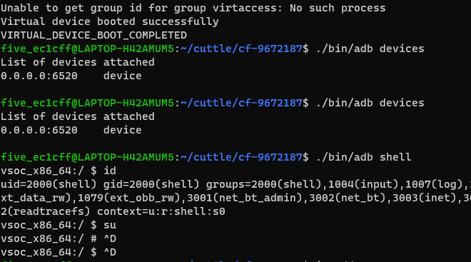
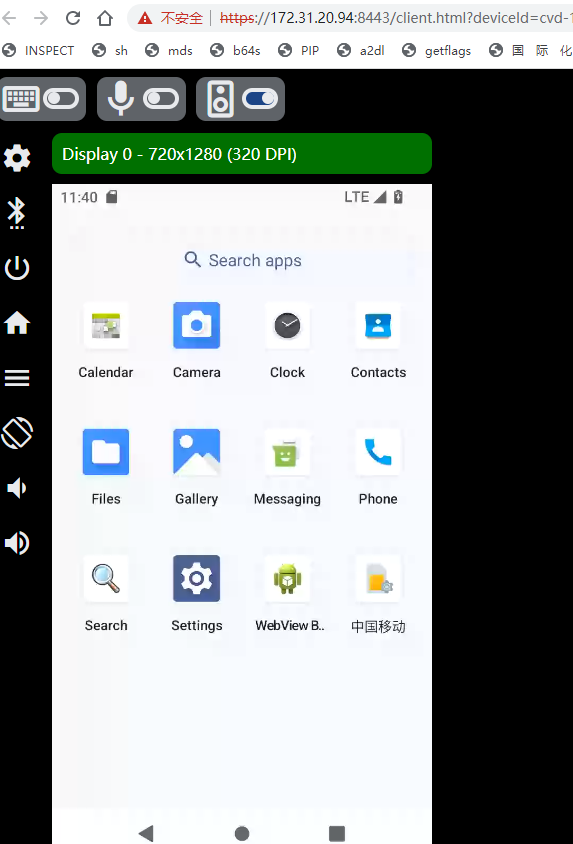
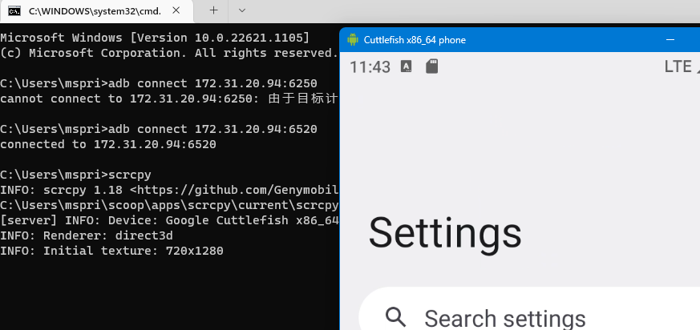

# WSL 上使用 cuttlefish

## 虚拟化

## 

[Use Cuttlefish to Launch an AOSP Build  |  Android Open Source Project](https://source.android.com/docs/setup/create/cuttlefish-use?hl=en)

### syslog

```
launch_cvd I 03-07 18:46:44    51    51 main.cc:186] Host changed from last run: 1
assemble_cvd D 03-07 18:46:44    72    72 fetcher_config.cpp:212] Could not find file ending in kernel
assemble_cvd D 03-07 18:46:44    72    72 fetcher_config.cpp:212] Could not find file ending in initramfs.img
assemble_cvd I 03-07 18:46:44    72    72 config_flag.cpp:148] Launching CVD using --config='phone'.
assemble_cvd D 03-07 18:46:44    72    72 subprocess.cpp:335] Started (pid: 75): /home/five_ec1cff/cuttle/android-cuttlefish/cf-64-9672187/bin/extract-ikconfig
assemble_cvd D 03-07 18:46:44    72    72 subprocess.cpp:337] /home/five_ec1cff/cuttle/android-cuttlefish/cf-64-9672187/boot.img
GPU auto mode: did not detect prerequisites for accelerated rendering support, enabling --gpu_mode=guest_swiftshader.
Requested resuming a previous session (the default behavior) but the base images have changed under the overlay, making the overlay incompatible. Wiping the overlay files.
Failed to run `/home/five_ec1cff/cuttle/android-cuttlefish/cf-64-9672187/bin/crosvm create_qcow2 --backing_file=/home/five_ec1cff/cuttle/android-cuttlefish/cf-64-9672187/cuttlefish/assembly/os_composite.img /home/five_ec1cff/cuttle/android-cuttlefish/cf-64-9672187/cuttlefish/instances/cvd-1/overlay.img`
stdout:
###

###
stderr:
###
failed to initialize syslog: guess of fd for syslog connection was invalid

###
Return code: "1"
launch_cvd E 03-07 18:46:50    51    51 subprocess.cpp:160] Subprocess 72 was interrupted by a signal: 6
launch_cvd E 03-07 18:46:50    51    51 main.cc:243] assemble_cvd returned -1
```

[syslog - No logs are written to /var/log - Ask Ubuntu](https://askubuntu.com/questions/615457/no-logs-are-written-to-var-log)

`sudo service rsyslog start`

### socket 长度

```
GPU auto mode: did not detect prerequisites for accelerated rendering support, enabling --gpu_mode=guest_swiftshader.
The following files contain useful debugging information:
  Serial console is disabled; use -console=true to enable it.
  Kernel log: /home/five_ec1cff/cuttle/android-cuttlefish/cf-64-9672187/cuttlefish/instances/cvd-1/kernel.log
  Logcat output: /home/five_ec1cff/cuttle/android-cuttlefish/cf-64-9672187/cuttlefish/instances/cvd-1/logs/logcat
  Point your browser to https://0.0.0.0:8443 to interact with the device.
  Launcher log: /home/five_ec1cff/cuttle/android-cuttlefish/cf-64-9672187/cuttlefish/instances/cvd-1/logs/launcher.log
  Instance configuration: /home/five_ec1cff/cuttle/android-cuttlefish/cf-64-9672187/cuttlefish/instances/cvd-1/cuttlefish_config.json
  Instance environment: /home/five_ec1cff/cuttle/android-cuttlefish/cf-64-9672187/.cuttlefish.sh
Unable to get group id for group virtaccess: No such process
Check failed: namelen <= sizeof(dest->sun_path) (namelen=111, sizeof(dest->sun_path)=108) MakeAddress failed. Name=/home/five_ec1cff/cuttle/android-cuttlefish/cf-64-9672187/cuttlefish/instances/cvd-1/internal/audio_server.sock is longer than allowed.
launch_cvd E 03-07 18:51:48   536   536 subprocess.cpp:160] Subprocess 911 was interrupted by a signal: 6
launch_cvd E 03-07 18:51:48   536   536 main.cc:271] run_cvd returned -1
```

稍微搜了一下源码，`Unable to get group id for group virtaccess` 没有问题。

下面的 socket 创建失败，仔细一看，是 socket 路径的长度超出了 unix 的限制(108 字节)

看来我的路径太长了，移动到上级目录解决。

### kvm 权限

daemon 启动后，adb 没有设备，访问 8443 也是黑屏。

查看日志 `/home/five_ec1cff/cuttle/cf-9672187/cuttlefish/instances/cvd-1/logs/launcher.log` ，发现竟然有 800 多 M 。

```
config_server E 03-07 19:10:50 14132 14132 host_device_config.cpp:143] Unable to obtain the network configuration
config_server F 03-07 19:10:50 14132 14132 main.cpp:35] Check failed: device_config_helper Could not open device config
openwrt D 03-07 19:10:50  1581  1581 log_tee.cpp:75] `--seccomp-policy-dir=/home/five_ec1cff/cuttle/cf-9672187/usr/share/cuttlefish/x86_64-linux-gnu/seccomp` is deprecated, please use `--seccomp-policy-dir /home/five_ec1cff/cuttle/cf-9672187/usr/share/cuttlefish/x86_64-linux-gnu/seccomp`
openwrt D 03-07 19:10:50  1581  1581 log_tee.cpp:75] [2023-03-07T19:10:50.077084673+08:00 ERROR crosvm] crosvm has exited with error: failed to create kvm: Permission denied (os error 13)
crosvm D 03-07 19:10:50  1578  1578 log_tee.cpp:75] [2023-03-07T19:10:50.077423777+08:00 ERROR crosvm] crosvm has exited with error: failed to create kvm: Permission denied (os error 13)
run_cvd I 03-07 19:10:50  1564  1564 process_monitor.cc:118] Detected unexpected exit of monitored subprocess /home/five_ec1cff/cuttle/cf-9672187/bin/crosvm
run_cvd I 03-07 19:10:50  1564  1564 process_monitor.cc:120] Subprocess /home/five_ec1cff/cuttle/cf-9672187/bin/crosvm (14127) has exited with exit code 1
```

WSL 中 kvm 权限居然是这样的：

```
$ ls /dev/kvm -l
crw------- 1 root root 10, 232 Mar  7 18:34 /dev/kvm
```

手动修改，不过下次启动估计就没了

### 网络接口

日志里面有 `Unable to obtain the network configuration`

```
https://cs.android.com/android/platform/superproject/+/master:device/google/cuttlefish/host/commands/assemble_cvd/flags.cc;l=1144;drc=5ca657189aac546af0aafaba11bbc9c5d889eab3
```

sudo ifconfig 并没发现 cvd 开头的接口。

检查服务，说不定是本来该有的服务没启动导致的：

```
sudo service --status-all
 [ - ]  cuttlefish-host-resources
 [ - ]  cuttlefish-operator
```

尝试启动第一个，报错缺少 nvidia-modprobe:

```
sudo service  cuttlefish-host-resources start
/etc/init.d/cuttlefish-host-resources: 296: /usr/bin/nvidia-modprobe: not found
```

安装：

```
sudo apt install nvidia-modprobe
```

再次启动，这回终于有 cvd 的网络接口了，但是系统还是没法启动

### vsock

```
crosvm D 03-07 20:04:05 23854 23854 log_tee.cpp:75] [2023-03-07T20:04:05.311805004+08:00 ERROR crosvm] crosvm has exited with error: failed to set up virtual socket device: failed to open virtual socket device: No such file or directory (os error 2)
run_cvd I 03-07 20:04:05 23837 23837 process_monitor.cc:118] Detected unexpected exit of monitored subprocess /home/five_ec1cff/cuttle/cf-9672187/bin/crosvm
run_cvd I 03-07 20:04:05 23837 23837 process_monitor.cc:120] Subprocess /home/five_ec1cff/cuttle/cf-9672187/bin/crosvm (8886) has exited with exit code 1
```

https://cs.android.com/android/platform/superproject/+/master:external/crosvm/devices/src/virtio/vhost/vsock.rs;l=37;drc=5ca657189aac546af0aafaba11bbc9c5d889eab3

`/dev/vhost-vsock` ，检查发现也没有。

编译 wsl 内核，加上 `CONFIG_VHOST_VSOCK`

这样 `/dev` 下就有 `vhost-vsock` 了，不过也要手动修改权限。

### minijail

```
crosvm D 03-07 21:25:59  4897  4897 log_tee.cpp:75] crosvm[1]: libminijail[1]: cannot mount '/usr/lib' as '/var/empty/usr/lib' with flags 0x1001: Invalid argument
crosvm D 03-07 21:25:59  4897  4897 log_tee.cpp:75] crosvm[1]: libminijail[1]: mount_one failed with /dev at '(null)'
crosvm D 03-07 21:25:59  4897  4897 log_tee.cpp:75] [2023-03-07T21:25:59.518552751+08:00 INFO  devices::acpi] Listening on acpi_mc_group of acpi_event family
crosvm D 03-07 21:25:59  4897  4897 log_tee.cpp:75] [2023-03-07T21:25:59.628342254+08:00 ERROR crosvm::crosvm::platform] child pcivirtio-gpu (pid 5025) died: signo 17, status 251, code 1
crosvm D 03-07 21:25:59  4897  4897 log_tee.cpp:75] [2023-03-07T21:25:59.632154845+08:00 ERROR devices::proxy] failed write to child device process pcivirtio-gpu: failed to send packet: Broken pipe (os error 32)
crosvm D 03-07 21:25:59  4897  4897 log_tee.cpp:75] [2023-03-07T21:25:59.632389102+08:00 ERROR devices::proxy] failed to read result of Shutdown from child device process pcivirtio-gpu: tube was disconnected
webRTC E 03-07 21:25:59  4907  5023 server.cpp:375] Client closed the connection
webRTC E 03-07 21:25:59  4907  4930 server.cpp:375] Client closed the connection
webRTC E 03-07 21:25:59  4907  5022 server.cpp:375] Client closed the connection
crosvm D 03-07 21:26:00  4897  4897 log_tee.cpp:75] [2023-03-07T21:26:00.308153485+08:00 INFO  crosvm] crosvm has exited normally
run_cvd I 03-07 21:26:00  4879  4879 process_monitor.cc:118] Detected unexpected exit of monitored subprocess /home/five_ec1cff/cuttle/cf-9672187/bin/crosvm
run_cvd I 03-07 21:26:00  4879  4879 process_monitor.cc:120] Subprocess /home/five_ec1cff/cuttle/cf-9672187/bin/crosvm (5018) has exited with exit code 0
```

strace ：

```
[pid 23377] mount("/usr/lib", "/var/empty/usr/lib", 0x55d56e610be0, MS_RDONLY|MS_BIND, NULL <unfinished ...>
[pid 23377] <... mount resumed>)        = -1 EINVAL (Invalid argument)
```

源码大概在这里：

```
external/minijail/libminijail.c
external/crosvm/ 
```

这个进程会 unshare ns 然后 remount `MS_REC|MS_PRIVATE` ，然后绑定挂载一些目录。不知道为什么这个 mount 失败了。

本来打算用 gdb 抓一下看看到底是什么问题，网都铺好了：

[linux - gdb catch syscall condition and string comparisson - Stack Overflow](https://stackoverflow.com/questions/37743596/gdb-catch-syscall-condition-and-string-comparisson)

[Set Catchpoints (Debugging with GDB)](https://sourceware.org/gdb/onlinedocs/gdb/Set-Catchpoints.html)

[Forks (Debugging with GDB)](https://sourceware.org/gdb/onlinedocs/gdb/Forks.html)

```
set detach-on-fork off
catch syscall mount
condition 1 $_streq((char *)$rdi, "/usr/lib")
attach ${run_cvd}
```

但是根本等不到断点，仔细一看，竟然正常启动了。日志中也没再出现那个 mount 失败的记录。

不知道到底是什么魔法，难道我一用 gdb 威胁它就正常了？

既然现在能用了，我也暂时不深究，还是体验一下这个所谓的 cuttlefish 。



桌面甚至有个中国移动的 SIM 卡应用，不知道它怎么出现的。

WebRTC:



手感不是很好，非常卡，在主机用 scrcpy 看看：



也是一样卡，就比 WebRTC 好那么一点点。

总体感觉不如 AVD …… 如果不是为了研究内核，没必要大费周章。

## 总结

想在 WSL 上正常跑 cuttlefish 用于研究，还需要走一段时间的路。

再次感受到瘟斗士用户的艰难，不如干脆把主力系统换成 Linux 罢！
