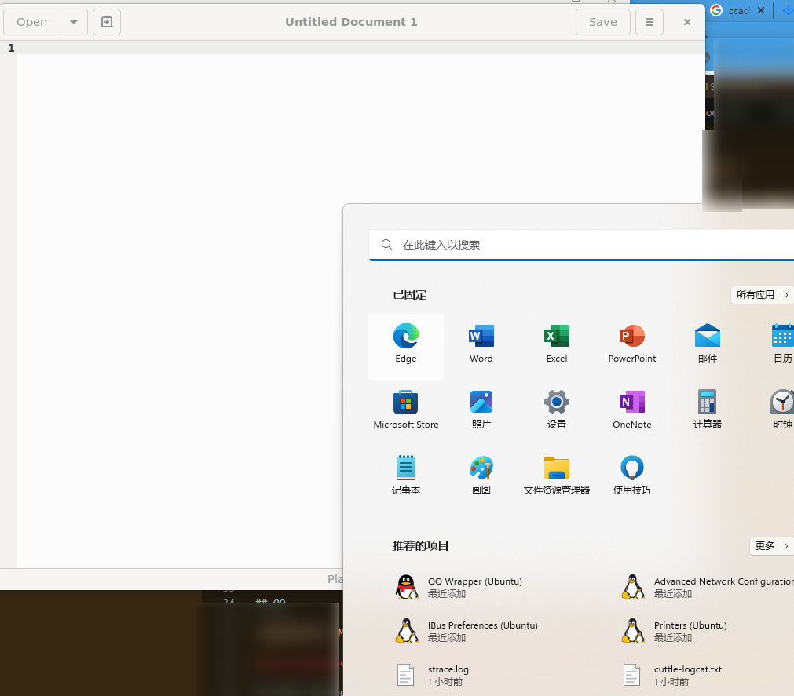
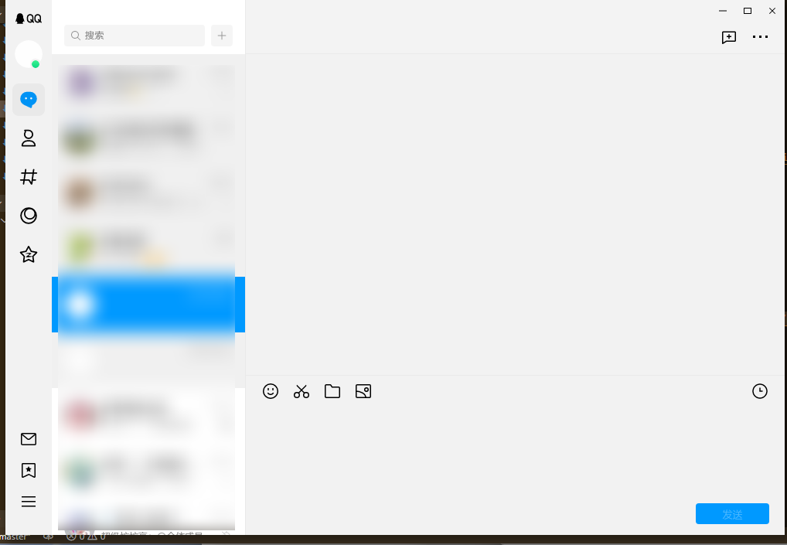

# WSL GUI 与 QQ

前段时间我的 ILPP 登不上了，因此又回归了电脑无 QQ 的时代。

由于自己所在的学校的原因，对 QQ 的依赖程度还是很高的，如果只靠手机，难以满足各种日常需求。

但是我又不想装那个带驱动的肮脏 PC QQ ，而新的 NT QQ Windows 版本还要过些日子才公测——当然，哪怕出了 Windows 版我也不太想装，毕竟 Windows 上想限制 QQ 的行为还是比较困难的。

曾经尝试过开一个 Windows 虚拟机的方法使用 QQ ，但是 Windows 虚拟机占用资源过多，很不方便。

既然 WSL 已经支持 GUI 了，而在 Linux 上有十万甚至九万种方法管住进程，不如就在 WSL 上跑 QQ 好了。

## GUI

[Run Linux GUI apps with WSL | Microsoft Learn](https://learn.microsoft.com/en-us/windows/wsl/tutorials/gui-apps)

```
wsl --update
```

似乎只要更新到 latest ，就可以安装任意 gui 程序了。

上面还说要安装对应显卡的驱动，以便硬件加速，不过我没装。

安装了一个 gedit 试了一下，可以运行。

## 体验

安装了 GUI 程序后，在系统的开始菜单生成了 GUI 程序的入口，当然也可以在终端启动。



不支持输入法穿透，但是可以剪切板穿透。

## 字体

安装后没有中文字体，下面有一个很有意思的方法：

[WSL2 安装中文字体_wsl安装字体_Abyss0729的博客-CSDN博客](https://blog.csdn.net/oZuoZuoZuoShi/article/details/118977701)

```
sudo ln -s /mnt/c/Windows/Fonts /usr/share/fonts
fc-cache -fv
```

## QQ

这里直接用好友 Mufanc <!-- Stron --> 写的 QWrap 

[Mufanc/QWrapper: 为 Linux QQ 提供基本的存储隔离，同时集成一些其它小功能](https://github.com/Mufanc/QWrapper)

启动和登录还是没问题的



使用作者原来写的 wrap 无法保存文件，但是可以保存图片。

于是修改了一下。

```
#!/usr/bin/sh
if [ "$1" = "--wrap" ] ; then
    exec bwrap --unshare-all --share-net \
    --dev-bind / / \
    --proc /proc \
    --bind "$HOME/QQHome" "$HOME" \
    --bind "/mnt/f/Downloads/LinuxQQ" "$HOME/Downloads" \
    --bind "$HOME/.config/QQ" "$HOME/.config/QQ" \
    --setenv LD_PRELOAD /opt/QQ/__patch__/libhook.so \
    --chdir "$HOME" \
    /opt/QQ/qq
else
    /opt/QQ/__patch__/daemon "$0"
fi
```

现在 home 绑定挂载了 home/QQHome ，而 Downloads 则绑定到 Windows 的 Downloads 。

> 本来想 home 挂载 tmpfs ，但这样会根本无法写 tmpfs ： `cannot create directory ‘Downloads’: Value too large for defined data type` ，原因未知。

这样下载的问题就解决了。

## 总结

现在总算是能在 Windows 上相对干净地使用 QQ 了，满足了我的洁癖。

新 QQ 虽然发消息不太方便（输入法问题），但起码可以接收消息，可以保存文件，已经满足了基本需求，平时也不必常开，需要用的时候打开就 OK （当然我目前还是必须要手机确认登录）

## TODO: vsock x11

[WSL2 GUI切换网络后保活（vsock） - 简书](https://www.jianshu.com/p/0aa58436b230)

## TODO: 输入法

……
